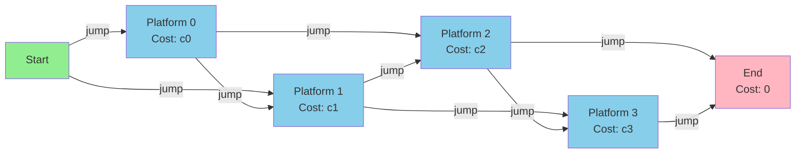
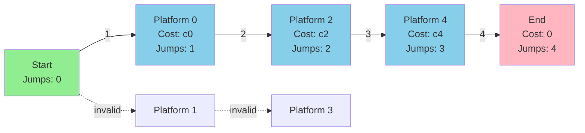
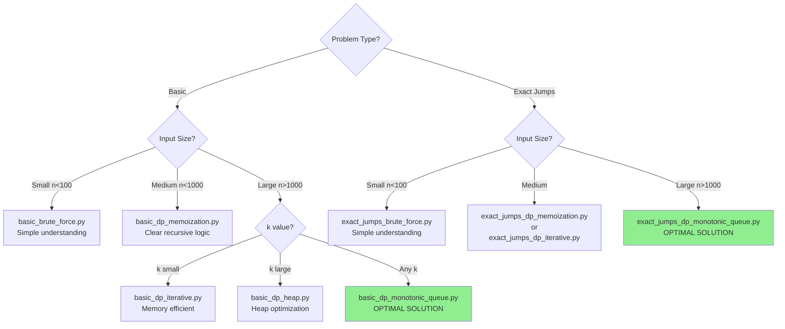

# AlgoRapids: Path Optimization Solutions

A comprehensive collection of algorithms solving river crossing optimization problems using dynamic programming, heap optimization, and monotonic queue techniques.

## Table of Contents

- [Overview](#overview)
- [Problem Definitions](#problem-definitions)
  - [Basic River Crossing Problem](#basic-river-crossing-problem)
  - [Exact Jumps River Crossing Problem](#exact-jumps-river-crossing-problem)
- [Algorithm Implementations](#algorithm-implementations)
- [Installation](#installation)
- [Usage](#usage)
  - [Input Format](#input-format)
  - [Output Format](#output-format)
  - [Running Examples](#running-examples)
- [Performance Comparison](#performance-comparison)
- [Project Structure](#project-structure)
- [Contributing](#contributing)
- [License](#license)
- [Author](#author)

## Overview

This project implements ten distinct algorithms to solve two variations of the river crossing optimization problem. The algorithms range from brute force approaches to highly optimized dynamic programming solutions, demonstrating progressively efficient techniques for solving constrained path optimization problems.

## Problem Definitions

### Basic River Crossing Problem

**Objective:** Find the minimum cost path to cross a river using platforms, where each platform has an associated cost and you can jump at most k platforms forward.

**Constraints:**

- n platforms, each with a cost
- Maximum jump distance of k platforms
- Must reach beyond the last platform
- Starting position is before the first platform (cost 0)

**Visualization:**



### Exact Jumps River Crossing Problem

**Objective:** Find the minimum cost path to cross a river using exactly m jumps.

**Constraints:**

- n platforms, each with a cost
- Maximum jump distance of k platforms
- Must make exactly m jumps to reach beyond the last platform
- Starting position is before the first platform (cost 0)

**Visualization:**



## Algorithm Implementations

### Basic River Crossing Algorithms

| Algorithm    | File                          | Strategy                     | Time Complexity | Space Complexity | Best Use Case                        |
| ------------ | ----------------------------- | ---------------------------- | --------------- | ---------------- | ------------------------------------ |
| Algorithm 1  | `basic_brute_force.py`        | Recursive brute force        | O(k^n)          | O(k^n)           | Educational purposes, small inputs   |
| Algorithm 2a | `basic_dp_memoization.py`     | Top-down DP with memoization | O(n·k)          | O(n)             | Medium inputs, clear recursive logic |
| Algorithm 2b | `basic_dp_iterative.py`       | Bottom-up DP                 | O(n·k)          | O(n)             | Memory-efficient medium inputs       |
| Algorithm 3  | `basic_dp_heap.py`            | DP with min-heap             | O(n·log n)      | O(n)             | Large inputs with large k            |
| Algorithm 4  | `basic_dp_monotonic_queue.py` | DP with monotonic queue      | O(n)            | O(n)             | **Optimal for large inputs**         |

### Exact Jumps River Crossing Algorithms

| Algorithm    | File                                | Strategy                     | Time Complexity | Space Complexity | Best Use Case                        |
| ------------ | ----------------------------------- | ---------------------------- | --------------- | ---------------- | ------------------------------------ |
| Algorithm 5  | `exact_jumps_brute_force.py`        | Recursive brute force        | O(k^n)          | O(k^n)           | Educational purposes, small inputs   |
| Algorithm 6a | `exact_jumps_dp_memoization.py`     | Top-down DP with memoization | O(n·m·k)        | O(n·m)           | Medium inputs, exact jump constraint |
| Algorithm 6b | `exact_jumps_dp_iterative.py`       | Bottom-up DP                 | O(n·m·k)        | O(n·m)           | Memory-conscious exact jumps         |
| Algorithm 7  | `exact_jumps_dp_heap.py`            | DP with min-heap             | O(n·m·log n)    | O(n·m)           | Large inputs with exact jumps        |
| Algorithm 8  | `exact_jumps_dp_monotonic_queue.py` | DP with monotonic queue      | O(n·m)          | O(n·m)           | **Optimal for exact jumps**          |

## Installation

### Prerequisites

- Python 3.7 or higher
- No external dependencies required

### Clone the Repository

```bash
git clone https://github.com/YashRajPandey/AlgoRapids-Path-Optimization-Solutions.git
cd AlgoRapids-Path-Optimization-Solutions
```

### Verify Installation

```bash
python --version
```

## Usage

### Input Format

**Basic Problem:**

```
n k
c1 c2 c3 ... cn
```

- `n`: Number of platforms
- `k`: Maximum jump distance
- `c1, c2, ..., cn`: Cost of each platform

**Exact Jumps Problem:**

```
n k m
c1 c2 c3 ... cn
```

- `n`: Number of platforms
- `k`: Maximum jump distance
- `m`: Exact number of jumps required
- `c1, c2, ..., cn`: Cost of each platform

### Output Format

The program outputs the indices of platforms in the optimal path (0-indexed), space-separated.

### Running Examples

**Using example files:**

```bash
python basic_brute_force.py < examples/example1_basic.txt

python exact_jumps_dp_monotonic_queue.py < examples/example1_exact.txt
```

**Interactive input:**

```bash
python basic_dp_monotonic_queue.py
5 2
3 2 4 1 6
```

**Example with explanation:**

Input:

```
5 2
3 2 4 1 6
```

This means:

- 5 platforms with costs [3, 2, 4, 1, 6]
- Can jump at most 2 platforms forward
- Need to find minimum cost path

Possible output:

```
0 2 4
```

This path costs: 3 + 4 + 6 = 13

## Performance Comparison

### When to Use Each Algorithm



### Complexity Comparison

| Algorithm Type       | Best Time  | Worst Time   | Space          | Notes                        |
| -------------------- | ---------- | ------------ | -------------- | ---------------------------- |
| Brute Force          | O(k^n)     | O(k^n)       | O(k^n)         | Exponential - avoid for n>10 |
| DP Memoization       | O(n·k)     | O(n·k·m)     | O(n) or O(n·m) | Good for understanding       |
| DP Iterative         | O(n·k)     | O(n·k·m)     | O(n) or O(n·m) | Memory efficient             |
| DP + Heap            | O(n·log n) | O(n·m·log n) | O(n) or O(n·m) | Good for large k             |
| DP + Monotonic Queue | **O(n)**   | **O(n·m)**   | O(n) or O(n·m) | **Optimal solution**         |

## Project Structure

```
AlgoRapids-Path-Optimization-Solutions/
├── basic_brute_force.py              # Algorithm 1: Brute force
├── basic_dp_memoization.py           # Algorithm 2a: Top-down DP
├── basic_dp_iterative.py             # Algorithm 2b: Bottom-up DP
├── basic_dp_heap.py                  # Algorithm 3: DP with heap
├── basic_dp_monotonic_queue.py       # Algorithm 4: DP with queue
├── exact_jumps_brute_force.py        # Algorithm 5: Brute force
├── exact_jumps_dp_memoization.py     # Algorithm 6a: Top-down DP
├── exact_jumps_dp_iterative.py       # Algorithm 6b: Bottom-up DP
├── exact_jumps_dp_heap.py            # Algorithm 7: DP with heap
├── exact_jumps_dp_monotonic_queue.py # Algorithm 8: DP with queue
├── examples/
│   ├── example1_basic.txt            # Basic problem sample 1
│   ├── example2_basic.txt            # Basic problem sample 2
│   ├── example1_exact.txt            # Exact jumps sample 1
│   ├── example2_exact.txt            # Exact jumps sample 2
│   └── README.md                     # Examples documentation
├── .gitignore                        # Git ignore patterns
├── requirements.txt                  # Python dependencies
├── CONTRIBUTING.md                   # Contribution guidelines
├── LICENSE                           # MIT License
└── README.md                         # This file
```

## Contributing

Contributions are welcome! Please read [CONTRIBUTING.md](CONTRIBUTING.md) for details on our code of conduct and the process for submitting pull requests.

### Quick Start for Contributors

1. Fork the repository
2. Create a feature branch
3. Make your changes with tests
4. Ensure code follows style guidelines
5. Submit a pull request

## License

This project is licensed under the MIT License - see the [LICENSE](LICENSE) file for details.

## Author

**Yash Raj Pandey**

This project demonstrates the power of dynamic programming and data structure optimization in solving real-world path optimization problems. From exponential brute force to linear time complexity, these algorithms showcase the evolution of algorithmic thinking and optimization techniques.
